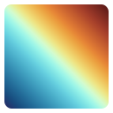
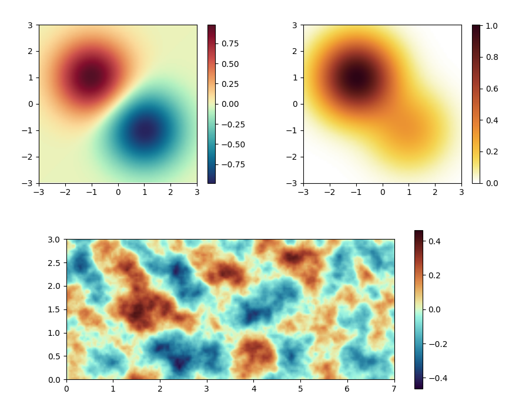

# OKPaletteLab


[](https://pypi.org/project/ok-palette-lab/)


[](https://github.com/pre-commit/pre-commit)



Smooth color maps for Plotly and matplotlib.

- Color maps are designed to be smooth using Oklch color space for better visualization of data.
- Following types of color maps are provided:
  - **Sequential** color maps for general ranges.
  - **Diverging** color maps for ranges centered at zero.
  - **Cyclic** color maps for periodic ranges.
- Currently supports following libraries:
  - [Plotly (graphing library for Python)](https://plotly.com/python/)
  - [matplotlib](https://matplotlib.org/)

## Sample Figures



## Installation

You can install the package via pip:

```bash
pip install ok_palette_lab
```

## Basic Usage

- With Plotly:
  - [`ok_palette_lab.plotly` package](https://okpalettelab.musicscience37.com/api/ok_palette_lab.plotly.html)
    has color maps (called "color scales" in Plotly).
  - Select one and use as follows:

    ```python
    figure = plotly.graph_objects.Figure()
    figure.add_heatmap(
        # ... your data here ...

        # Specify a color map.
        colorscale=ok_palette_lab.plotly.autumn,
    )
    ```

- With matplotlib:
  - [`ok_palette_lab.matplotlib` package](https://okpalettelab.musicscience37.com/api/ok_palette_lab.matplotlib.html)
    has color maps.
  - Select one and use as follows:

    ```python
    figure, axes = matplotlib.pyplot.subplots()
    heatmap = axes.imshow(
        # ... your data here ...

        # Specify a color map.
        cmap=ok_palette_lab.matplotlib.autumn,
    )
    ```

## Simple Examples

- [Example of a heatmap using Plotly](https://okpalettelab.musicscience37.com/how_to/plotly/use_in_heatmap.html)
- [Example of a heatmap using matplotlib](https://okpalettelab.musicscience37.com/how_to/matplotlib/use_in_heatmap.html)

## Documentation

Documentation is available at:

- [main branch](https://okpalettelab.musicscience37.com/)
- [v0.2.0](https://okpalettelab.musicscience37.com/v0.2.0/)
- [v0.1.0](https://okpalettelab.musicscience37.com/v0.1.0/)

## Development

This project has been created recently, and is under active development.
Following features are planned for future releases:

- Color maps for dark mode.
- Support for more graphing libraries in Python.
- Support for ParaView.

## Repositories

- [Main in GitLab](https://gitlab.com/MusicScience37Projects/utility-libraries/OKPaletteLab)
- [Mirror in GitHub](https://github.com/MusicScience37/OKPaletteLab)

## License

This project is licensed under the MIT License.
See [License.txt](License.txt) for details.

Graphics created using color maps in this project can be used freely without any restrictions.
