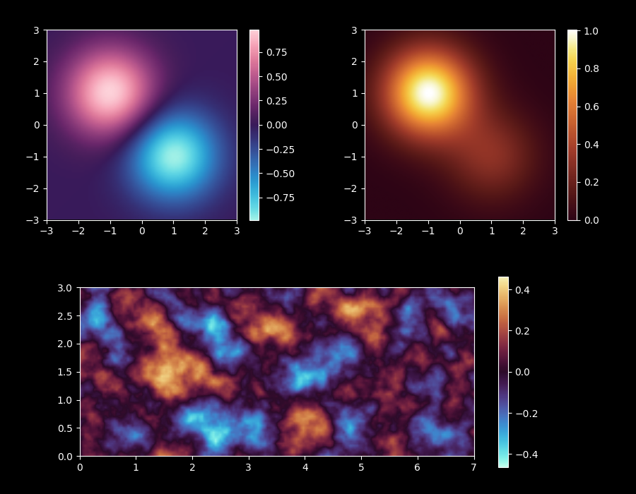

OKPaletteLab
===============

Smooth color maps using Oklch color space for Plotly and matplotlib.

.. image:: ../images/combined.png
   :alt: Sample figures
   :class: only-light

Table of Contents
--------------------

.. toctree::
    :maxdepth: 2
    :caption: Usage

    how_to/index
    color_maps

.. toctree::
    :maxdepth: 2
    :caption: Gallery

    samples/index

.. toctree::
    :maxdepth: 1
    :caption: Reference

    api/modules

.. toctree::
    :maxdepth: 1
    :caption: About

    license
    release_notes/index
